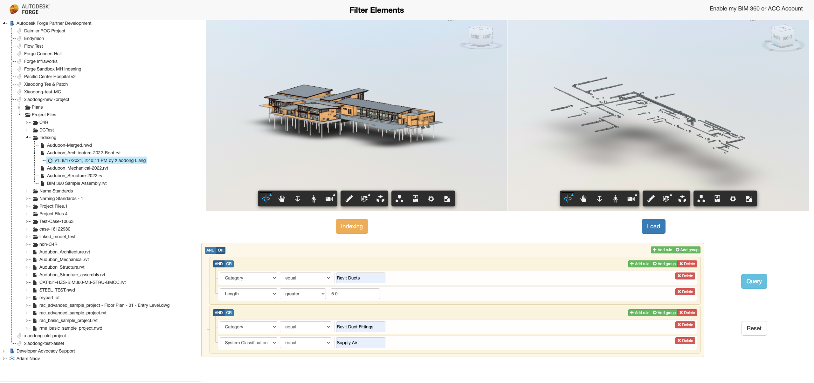
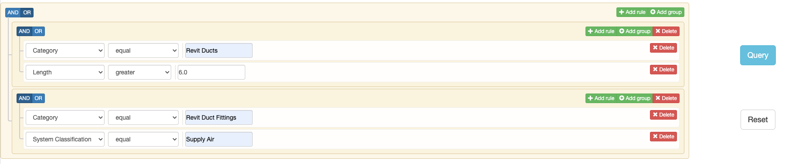

# Forge Filter Elements by Index API of BIM360 / ACC - Nodejs

 

 

# Description

This sample demonstrates the use case to filter model elements with specific queries conditions and load those filtered elements in Forge Viewer. It uses **Model Properties API** of BIM360 or ACC to index & query the elements.

# Thumbnail
 

# Demonstration

 

# Setup

## Prerequisites

1. **Forge Account**: Learn how to create a Forge Account, activate subscription and create an app at [this tutorial](http://learnforge.autodesk.io/#/account/). For this new app, use **http://localhost:3000/api/forge/callback/oauth** as Callback URL. Finally take note of the **Client ID**, **Client Secret** and Callback URL.
2. **BIM 360 or ACC Account**: must be Account Admin to add the app integration. [Learn about provisioning](https://forge.autodesk.com/blog/bim-360-docs-provisioning-forge-apps). 
3. **Node.js**: basic knowledge with [**Node.js**](https://nodejs.org/en/).
4. Basic knowledge with **html5**,**JavaScript**, **css**,**jQuery**, **bootstrap** etc. 
5. Basic knowledge with **Data Management API with BIM360 or ACC**,**Forge Viewer** etc.s 

## Running locally

Install [NodeJS](https://nodejs.org), version 8 or newer.

Clone this project or download it (this `nodejs` branch only). It's recommended to install [GitHub desktop](https://desktop.github.com/). To clone it via command line, use the following (**Terminal** on MacOSX/Linux, **Git Shell** on Windows):

    git clone https://github.com/Autodesk-Forge/forge-model.properties-elements.filtering

Install the required packages using `npm install`. Set the enviroment variables with your client ID, client secret, callback url and finally start it. Via command line, navigate to the folder where this repository was cloned and use the following:

Mac OSX/Linux (Terminal)

    npm install
    export FORGE_CLIENT_ID=<<YOUR CLIENT ID FROM DEVELOPER PORTAL>>
    export FORGE_CLIENT_SECRET=<<YOUR CLIENT SECRET>>
    export FORGE_CALLBACK_URL=<<YOUR CALLBACK URL>>
    npm start

Windows (use **Node.js command line** from Start menu)

    npm install
    set FORGE_CLIENT_ID=<<YOUR CLIENT ID FROM DEVELOPER PORTAL>>
    set FORGE_CLIENT_SECRET=<<YOUR CLIENT SECRET>>
    set FORGE_CALLBACK_URL=<<YOUR CALLBACK URL>>
    npm start

OR, set enviroment variables at [launch.json](/.vscode/launch.json) for debugging.

 
 ## Use Cases

1. Open the browser: [http://localhost:3000](http://localhost:3000). Please watch the [Video](https://youtu.be/sJmeiK3xYTU) for the detail and usage.

2. After the user logging succeeds, the code will start to extract all hubs, all projects, folders and model versions.

3. Click one model version, the corresponding model data will be loaded in left Forge Viewer. Click **Index** button to start indexing  

4. After Indexing in step #3 is is done, setup the query conditions in the query panel, click the **Query** button, the code will start to query the specific elements by the queries. 

 

5. After querying is completed, click **Load** button, only the elements that match the conditions will be loaded in the viewer.  

## Limitations

The indexing of model have a lot of properties. This sample uses [JqueryBuilder](https://querybuilder.js.org/) for the users to input filtering conditions. Only a few properties options are initialized in [queryBuilder.js](./public/js/queryBuilder.js#L30-L161). you will need to add more yourself if needed. In addition, not all conditions are transformed to the query of Indexing API.  to add more conditions, follow the similar logic in the click event of [**query** button](./public/js/queryBuilder.js#L240-L295). 

## Deployment

To deploy this application to Heroku, the **Callback URL** for Forge must use your `.herokuapp.com` address. After clicking on the button below, at the Heroku Create New App page, set your Client ID, Secret and Callback URL for Forge.

### Tips & Tricks

For local development/testing, consider use [nodemon](https://www.npmjs.com/package/nodemon) package, which auto restart your node application after any modification on your code. To install it, use:

    sudo npm install -g nodemon

Then, instead of **npm run dev**, use the following:

    npm run nodemon

Which executes **nodemon server.js --ignore www/**, where the **--ignore** parameter indicates that the app should not restart if files under **www** folder are modified.

### Troubleshooting

After installing Github desktop for Windows, on the Git Shell, if you see a ***error setting certificate verify locations*** error, use the following:

    git config --global http.sslverify "false"
 
# Further Reading

- [Data Management API](https://developer.autodesk.com/en/docs/data/v2/overview/)
- [Viewer](https://developer.autodesk.com/en/docs/viewer/v6)
- [Model Properties API Reference](https://forge.autodesk.com/en/docs/acc/v1/reference/http/index-v2-index-jobs-batch-status-post/)
- [Model Properties API Walkthrough in PowerShell Core](https://github.com/Autodesk-Forge/forge-model-properties.powershell)
- [Postman Collection for Model Properties](https://github.com/Autodesk-Forge/forge-model.properties-postman.collection)
- [Querying Model Properties](https://forge.autodesk.com/en/docs/acc/v1/tutorials/model-properties/query)
- [Tracking Changes in Model Versions](https://forge.autodesk.com/en/docs/acc/v1/tutorials/model-properties/diff)
- [Query Language Reference](https://forge.autodesk.com/en/docs/acc/v1/tutorials/model-properties/query-ref)

### Blogs
- [Forge Blog](https://forge.autodesk.com/categories/bim-360-api)
- [Field of View](https://fieldofviewblog.wordpress.com/), a BIM focused blog

## License
This sample is licensed under the terms of the [MIT License](http://opensource.org/licenses/MIT). Please see the [LICENSE](LICENSE) file for full details.

## Written by
Xiaodong Liang [@coldwood](https://twitter.com/coldwood), [Forge Advocate and Support](http://forge.autodesk.com)

